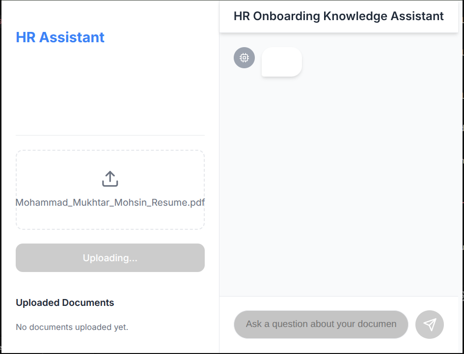

# HR Onboarding Knowledge Assistant

This project is a web-based knowledge assistant designed to streamline the HR onboarding process. New hires can ask questions in natural language and get answers based on the documents provided, such as company policies, handbooks, and other onboarding materials.




## Features

- **Document Upload**: Upload PDF, DOCX, and TXT files containing onboarding information.
- **Natural Language Queries**: Ask questions in plain English and get relevant answers.
- **AI-Powered**: Utilizes Large Language Models (LLMs) to understand and respond to queries.
- **Vector Search**: Employs a vector database to efficiently search for relevant information within the uploaded documents.
- **Web-Based Interface**: A simple and intuitive web interface for easy interaction.

## Tech Stack

### Frontend

- **React**: A JavaScript library for building user interfaces.
- **Vite**: A fast build tool for modern web development.
- **Axios**: A promise-based HTTP client for the browser and Node.js.
- **pnpm**: A fast, disk space-efficient package manager.

### Backend

- **Python**: A versatile programming language.
- **Flask**: A lightweight web framework for Python.
- **LangChain**: A framework for developing applications powered by language models.
- **ChromaDB**: An open-source embedding database.
- **Google Generative AI**: For accessing Google's large language models.

## Getting Started

Follow these instructions to get a copy of the project up and running on your local machine for development and testing purposes.

### Prerequisites

- [Node.js](https://nodejs.org/) (which includes npm)
- [Python 3.x](https://www.python.org/downloads/)
- [pip](https://pip.pypa.io/en/stable/installation/)
- [pnpm](https://pnpm.io/installation)

### Installation

1.  **Clone the repository:**

    ```bash
    git clone https://github.com/your-username/HR-Onboarding-Knowledge-Assistant.git
    cd HR-Onboarding-Knowledge-Assistant
    ```

2.  **Set up the backend:**

    - Navigate to the `backend` directory:
      ```bash
      cd backend
      ```
    - Create a virtual environment:
      ```bash
      python3 -m venv venv
      ```
    - Activate the virtual environment:
      - On Windows:
        ```bash
        venv\Scripts\activate
        ```
      - On macOS and Linux:
        ```bash
        source venv/bin/activate
        ```
    - Install the required Python packages:
      ```bash
      pip install -r requirements.txt
      ```
    - Create a `.env` file and add your Google API key:
      ```
      GOOGLE_API_KEY=your_google_api_key
      ```

3.  **Set up the frontend:**

    - Navigate to the `frontend` directory:
      ```bash
      cd ../frontend
      ```
    - Install the required Node.js packages using pnpm:
      ```bash
      pnpm install
      ```

### Running the Application

1.  **Start the backend server:**

    - Make sure you are in the `backend` directory with the virtual environment activated.
    - Run the Flask application:
      ```bash
      python app.py
      ```
    - The backend server will start on `http://127.0.0.1:5000`.

2.  **Start the frontend development server:**

    - Make sure you are in the `frontend` directory.
    - Run the Vite development server:
      ```bash
      pnpm run dev
      ```
    - The frontend application will be available at `http://localhost:5173`.

## Usage

1.  Open your web browser and navigate to `http://localhost:5173`.
2.  Use the interface to upload relevant HR documents (e.g., employee handbook, company policies).
3.  Once the documents are uploaded and processed, you can start asking questions in the chat interface.
4.  The assistant will provide answers based on the information contained in the uploaded documents.

## API Endpoints

- `POST /upload`: Upload a document (`.pdf`, `.docx`, or `.txt`).
- `POST /chat`: Send a query to the assistant and receive a response.

---

Happy Onboarding!
